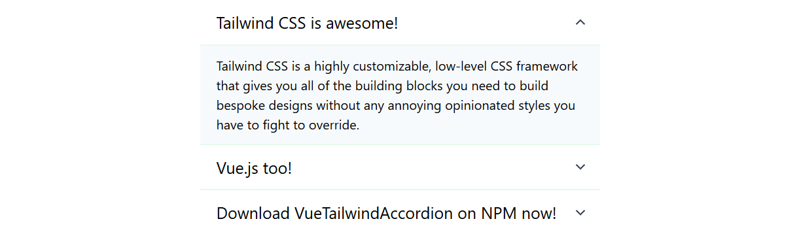

# DEPRECATED

# **Vue Tailwind Accordion**

[](https://www.npmjs.com/package/vue-tailwind-accordion)
[](https://github.com/ewilan-riviere/dependencies-badges/blob/master/LICENSE)

[](https://nodejs.org/en/)
[](https://vuejs.org/)
[](https://tailwindcss.com/)

Tailwind Accordion for Vue.js, based on [**Vue.js Accordion Component**](https://codepen.io/anzk/pen/qBEqXGZ) by Anzhelika Kovalchuk



## **Documentation**

Install it with Yarn or NPM

```bash
yarn add -D vue-tailwind-accordion
```

**OR**

```bash
npm i vue-tailwind-accordion --save-dev
```

Import it, ES6 way, in `main.js` / `app.js` file

```js
import VueTailwindAccordion from 'vue-tailwind-accordion'

Vue.use(VueTailwindAccordion)
```

Use it in a `.vue` file

```vue
<template>
  <div class="container w-1/2 mx-auto my-5">
    <vue-tailwind-accordion :content="data"></vue-tailwind-accordion>
  </div>
</template>

<script>
export default {
  data() {
    return {
      data: [
        {
          title: 'Tailwind CSS is awesome!',
          content:
            'Tailwind CSS is a highly customizable, low-level CSS framework that gives you all of the building blocks you need to build bespoke designs without any annoying opinionated styles you have to fight to override.',
        },
        {
          title:
            'Vue.js too!',
          content:
            'Vue is a progressive framework for building user interfaces. Unlike other monolithic frameworks, Vue is designed from the ground up to be incrementally adoptable. The core library is focused on the view layer only, and is easy to pick up and integrate with other libraries or existing projects. On the other hand, Vue is also perfectly capable of powering sophisticated Single-Page Applications when used in combination with modern tooling and supporting libraries.',
        },
        {
          title: 'Download VueTailwindAccordion on NPM now!',
          content:
            'Relied upon by more than 11 million developers worldwide, npm is committed to making JavaScript development elegant, productive, and safe. The free npm Registry has become the center of JavaScript code sharing, and with more than one million packages, the largest software registry in the world. Our other tools and services take the Registry, and the work you do around it, to the next level. ',
        },
      ],
    }
  },
}
</script>
```

## **License**

[**MIT**](https://github.com/ewilan-riviere/vue-tailwind-accordion/blob/master/LICENSE)
